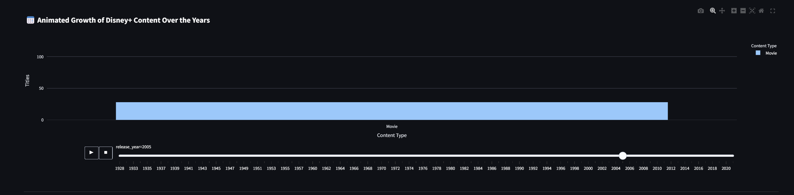

# Getting Started

# 📺 DisneyPlus-EDA-Analysis

Exploratory Data Analysis of Disney+ Movies & TV Shows dataset using Python.

📦 Dataset: Disney+ Dataset on Kaggle

Source: https://www.kaggle.com/datasets/shivamb/disney-movies-and-tv-shows

Includes metadata: title, type, rating, genres, and release dates

## 🎯 Project Goals

- Understand Disney+ content by **type**, **genre**, **rating**, and **release year**
- Analyze **trends over time**, and explore top genres
- Build an **interactive dashboard** for storytelling and insights
- Add advanced features like:
  - Mood-based recommendations
  - Animated timeline 📊
  - Data download 📂
  - YouTube trailer links 🎥

## 🗓️ Project Timeline

| Phase | Description | Dates |
|-------|-------------|-------|
| Phase 1 | Setup, Data Cleaning, GitHub Init | March 16–17 |
| Phase 2 |Exploratory Data Analysis | March 18–22 |
| Phase 3 | Dashboard Development & Interactivity | 	March 23–25 |
| Phase 4 |Final Touches & Deployment | March 27|

# 📺 DisneyPlus EDA & Interactive Dashboard

> **Exploratory Data Analysis** + **Interactive Dashboard** on Disney+ Movies & TV Shows using Python and Streamlit.

![Dashboard Screenshot]

---
📊 Dashboard Features

Feature	Description
🎛️ Sidebar filters	Filter by year, type, genre

📊 Visual Tabs	Neatly separates insights into sections

🧠 Insights beside charts	Clear takeaways throughout

📈 Animated Timeline (Plotly)	See how Disney+ grew by year

🤖 Mood-Based Recommender	Get genre picks based on how you feel

🎬 “Surprise Me” Button	Random movie picker with trailer link

📂 Download Button	Export filtered dataset

🎨 Netflix-style Theme	Custom dark theme for a polished feel

---
### 🎞️ Animated Timeline Preview

---
## 🚀 Live App

🔗 [Check out the Streamlit Dashboard](https://disneyplus-eda-analysis-gfyfny4vyfxhmd5lzb6ywg.streamlit.app)

🔧 Tools & Libraries Used
Python 3

Pandas, Matplotlib, Seaborn

Plotly, Altair (for animations)

Streamlit (for the dashboard)

GitHub (project hosting and README)

---
📥 How to Run Locally

To explore this project locally, follow these steps 👇

git clone https://github.com/cam-spec/DisneyPlus-EDA-Analysis.git

cd disneyplus_dashboard

pip install -r requirements.txt

streamlit run app.py

---

## 📓 Notebooks

Explore the step-by-step EDA process and feature experimentation using Jupyter Notebooks:

- [DisneyPlus Phase 2: EDA + Feature Engineering](DisneyPlus_Phase3_FINAL%20(3).ipynb): Final visualizations, modeling ideas, and insights before deployment to Streamlit.
- [GitHubProject.ipynb](GithubProject%20(1).ipynb): Supporting project analysis and visualization testing.

Each notebook complements the dashboard by showing behind-the-scenes development and reasoning.

---

🧪 Example Output from EDA Notebook – Content Rating Distribution

---
## 🚀 Next Steps

- Integrate a recommendation model based on user preferences
- Use a content-based filtering approach
- Add more metadata (runtime, countries, languages)

---

🧑‍💻 Author

Camron Njock

🎓 BSc Data Science @ National College of Ireland

[🔗 LinkedIn](https://www.linkedin.com/in/camron-njock-003812262/) | https://github.com/cam-spec

